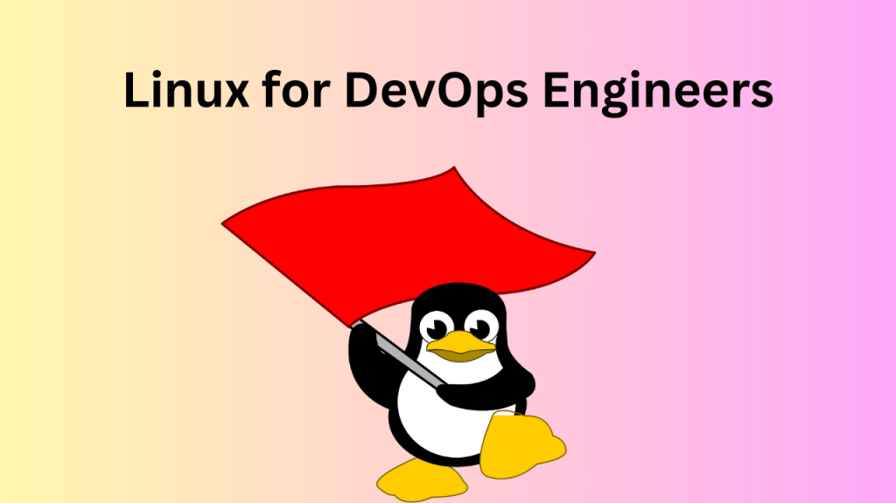

# Introduction
In today’s fast-paced and highly competitive tech industry, DevOps has become a crucial methodology for organizations looking to streamline their software development and deployment processes. At the heart of this methodology lies Linux, the open-source operating system that empowers DevOps engineers to achieve scalability, flexibility, and automation. In this blog post, I will explore the fundamental concepts, tools, and techniques that every DevOps engineer should be familiar with when working with Linux.

## What is Linux and why is it important for DevOps?
Linux is an open-source operating system that was initially developed as a free alternative to proprietary Unix-based systems. It has grown into a robust and widely adopted operating system used in various domains, including servers, embedded systems, desktops, and mobile devices. Linux is known for its stability, security, flexibility, and scalability, making it an ideal choice for DevOps practices. Here’s why Linux is important for DevOps:

- **Open-source nature**: Linux’s open-source nature allows DevOps engineers to access and modify the source code, enabling customization and optimization to meet specific requirements. This flexibility is crucial for tailoring the operating system to fit the needs of different software development and deployment workflows.
- **Stability and reliability**: Linux has a reputation for stability and reliability, making it an ideal choice for critical systems and large-scale deployments. Its robust architecture and continuous improvements through community-driven development ensure a solid foundation for DevOps workflows.
- **Command-line interface (CLI)**: The command-line interface is a vital aspect of Linux, providing powerful tools and utilities for managing and automating various tasks. DevOps engineers often leverage the CLI to write scripts, automate processes, and perform system administration, enabling efficient and streamlined operations.
- **Extensive software ecosystem**: Linux boasts a vast ecosystem of open-source software and tools that align perfectly with DevOps principles. From configuration management tools like Ansible and Puppet to containerization platforms like Docker and Kubernetes, Linux provides a rich environment for implementing DevOps practices.
- **Compatibility and portability**: Linux offers broad hardware and software compatibility, making it adaptable to diverse environments. DevOps engineers can easily deploy applications on different Linux distributions and cloud platforms, ensuring portability and minimizing compatibility issues during the development and deployment stages.

## Different Linux distributions
When it comes to Linux distributions, there is a wide range of options available, each with its own characteristics and strengths. Here are some popular distributions that are commonly used in the DevOps community:

- **Ubuntu**: Ubuntu is one of the most widely known and user-friendly Linux distributions. It is based on Debian and offers a balance between ease of use and robustness. Ubuntu has a strong focus on regular releases and provides Long Term Support (LTS) versions, ensuring stability and security updates for an extended period. Ubuntu has a large community and extensive documentation, making it an excellent choice for beginners and experienced users alike.
- **CentOS**: CentOS, derived from Red Hat Enterprise Linux (RHEL), is known for its stability, security, and long-term support. CentOS aims to provide a free and open-source alternative to RHEL, making it suitable for production environments. It is widely used in enterprise setups, web servers, and cloud environments. CentOS follows the same release cycle as RHEL and offers a stable platform for DevOps operations.
- **Fedora**: Fedora is a community-driven Linux distribution sponsored by Red Hat. It is known for its cutting-edge features, frequent releases, and focus on the latest software advancements. Fedora serves as a testing ground for technologies that eventually make their way into Red Hat Enterprise Linux. It is a popular choice for developers and enthusiasts who want access to the latest software and features.
- **Arch Linux**: Arch Linux is a lightweight and highly customizable distribution that follows a “do-it-yourself” approach. It provides a minimalist base and allows users to build their desired system from the ground up. Arch Linux emphasizes simplicity, elegance, and user-centric design. It offers a rolling release model, providing continuous updates and access to the latest software versions.
- **SUSE Linux Enterprise Server (SLES)**: SUSE Linux Enterprise Server is a commercial Linux distribution designed for mission-critical workloads and enterprise environments. It offers advanced features like high availability, clustering, and enterprise-level support. SLES is widely used in large-scale deployments and industries such as finance, healthcare, and manufacturing.

## Linux Commands That Every DevOps Engineer Should Know
As a DevOps engineer, mastering certain Linux commands is essential for efficient system administration, automation, and troubleshooting. Here are some crucial Linux commands that every DevOps engineer should know:

### File and Directory Management
- `ls`: List files and directories.
- `cd`: Change the current directory.
- `pwd`: Print the current working directory.
- `mkdir`: Create a new directory.
- `rm`: Remove files and directories.
- `cp`: Copy files and directories.
- `mv`: Move or rename files and directories.
- `find`: Search for files and directories.
- `chmod`: Change file permissions.
- `chown`: Change file ownership.
- `chgrp`: Change file group ownership.

### Text Manipulation and Viewing
- `cat`: Concatenate and display file contents.
- `grep`: Search for patterns in files.
- `head`: Display the beginning of a file.
- `tail`: Display the end of a file.
- `less`: View file contents interactively.
- `sed`: Stream editor for text manipulation.
- `awk`: Text processing and data extraction tool.

### Process and System Management
- `ps`: View running processes.
- `top`: Monitor system resources and processes in real-time.
- `kill`: Terminate processes.
- `systemctl`: Manage system services.
- `service`: Control system services (older Linux distributions).
- `df`: Display disk space usage.
- `du`: Estimate file and directory disk usage.
- `free`: Display system memory usage.
- `uptime`: Show system uptime and load averages.

### Networking
- `ping`: Send ICMP echo requests to a host.
- `curl` or `wget`: Download files from the web.
- `ssh`: Securely connect to remote systems.
- `scp`: Securely copy files between systems.
- `netstat`: Network statistics and connections.
- `ifconfig` or `ip`: Network interface configuration.
- `iptables` or `ufw`: Firewall configuration.

### Package Management
- `apt` (Debian/Ubuntu) or `yum` (CentOS/RHEL): Package management commands for installing, updating, and removing software packages.
- `dpkg` (Debian/Ubuntu) or `rpm` (CentOS/RHEL): Package management commands for querying package information and managing individual packages.

### Compression and Archiving
- `tar`: Create and extract tar archives.
- `gzip`, `gunzip`, `bzip2`, `unzip`: Compress and decompress files.
- `zip`: Create and extract ZIP archives.

## Conclusion
Linux has emerged as the backbone of modern-day DevOps practices, enabling organizations to achieve scalability, agility, and automation in their software development and deployment processes. By mastering Linux and its related tools and technologies, DevOps engineers can streamline workflows, improve efficiency, and deliver high-quality applications with ease. Whether you are a seasoned DevOps professional or just starting your journey, investing time and effort in understanding Linux is a crucial step toward becoming a proficient DevOps engineer.
