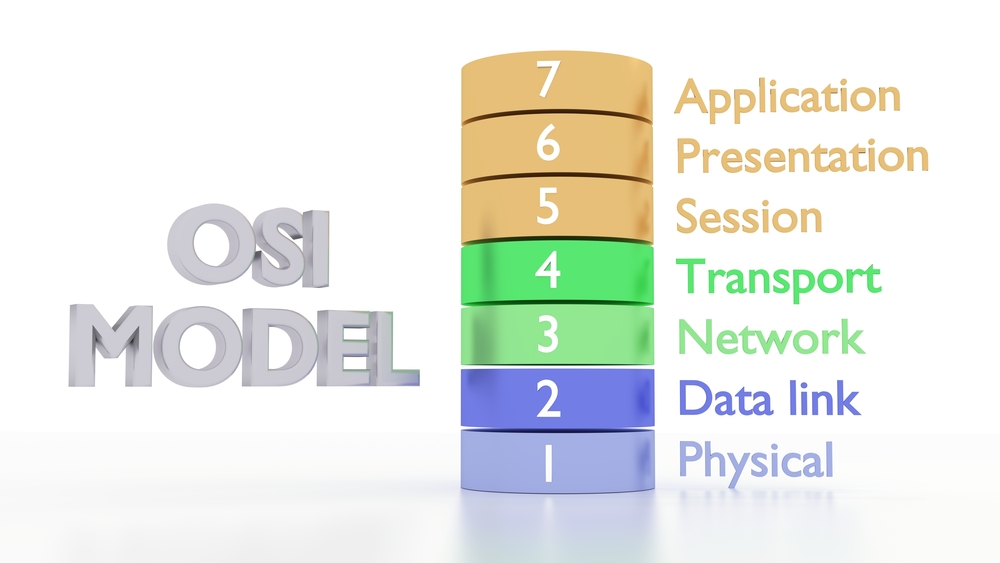
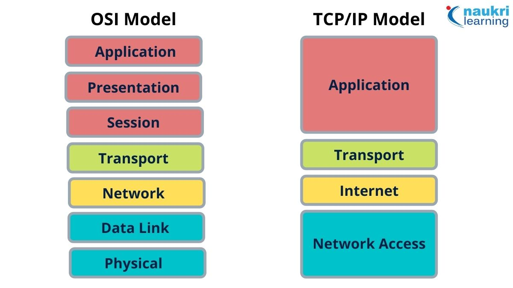

*Whether you are new to the world of development, or have been building things for a long time — or even if you’re a person who just likes computers and uses the internet daily — you’ve got to know the basics of networking and specifically Computer Networks.*

# Networking in DevOps: Building Bridges for Faster Delivery

DevOps is all about teamwork and being able to adapt quickly. While writing code is very important, having a strong network is equally essential because it connects all parts of the system. For DevOps engineers, knowing how networks work is key to making sure everything runs smoothly, resources are used efficiently, and systems stay secure. This documentation will explain different parts of networking in DevOps.

## OSI Model

Imagine a complex highway system.  Networks function similarly, with data packets flowing across various layers. Mastering the OSI (Open Systems Interconnection) model provides a solid foundation.

The **Open Systems Interconnection (OSI) model** is a set of standards that defines how computers communicate over a network. In the OSI model, data flow gets broken down into **seven layers** that build upon each other. Each layer uses data from the layer before it and serves a specific purpose in the broader network communication.

The OSI model works from the bottom up, beginning from layer 1 (Physical) and ending with the top layer 7 (Application). The top layer is the most direct point of user interaction with the OSI model—if you’re reading this article on a device, you’re working on the 7th layer at this very moment.

### Layer 1: Physical
The Physical layer handles raw data within physical media. That raw data is made up of bit of information and the Physical layer converts those into electrical signals that define certain aspects of a piece of physical media. For example, Physical layer specifications may define aspects like voltage levels, transmission distances, and cable standards. You find Physical-layer specifications in technologies like Bluetooth and Ethernet.

### Layer 2: Data Link
The Data Link layer takes data in the form of electrical signals (frames) and delivers them across members (nodes) of a single network. Data Link frames only operate on a local network and do not cross the boundaries into other networks.

The Data Link layer can also detect and recover transmission errors by attaching extra information containing an error detection code to a given frame. When that frame is sent across the network, its receiver checks the received frame by matching the extracted data with the code.

### Layer 3: Network
A Network describes the entire ecosystem of subnetworks and other networks that are all connected to each other via special hosts called gateways or routers. The Network layer works with routes (paths from one network to another). The Layer determines the most effective route to convey information. Sometimes, the message you’re trying to send is particularly large. In this case, the network may split it into several fragments at one node, send them separately, and reassemble them at the destination node.

### Layer 4: Transport
The Transport layer protocols provide host-to-host communication services for applications. It is responsible for connection-oriented communication, reliability, and flow control. Connection-oriented communication uses a pre-established connection between hosts as a pathway for communicating between applications. Some protocols of the Transport layer are connection-oriented, but some protocols of this layer are not connection-oriented and instead transfer data end-to-end without the need for connection.

### Layer 5: Session
The Session layer controls connections, whether that’s keeping an eye on possible connection losses or temporarily closing or re-opening connections depending on their frequency of use. The protocols of the Session layer try to recover any connection losses when they happen. It also optimizes connections: if a connection is not used for a long period, Session-layer protocols may close it and re-open it later. These protocols also provide synchronization points in the stream of exchanged messages, or in other words, spots for large messages to momentarily regather and make sure they’re all on the same page.

### Layer 6: Presentation
The Presentation layer also called a Syntax layer, ensures that the recipient of the information can read and understand what it receives from another system; the information is presented in a legible way. Processes such as data encoding, compression, and encryption happen on this layer.

### Layer 7: Application
The OSI model’s top and final layer is the Application layer. The Application layer displays the data in the correct format to the end-user—you! This includes technologies such as HTTP, DNS, FTP, SSH, and much more. Almost everyone interacts with the protocols of the Application layer on a day-to-day basis (not just you DevOps engineers).

Understanding these layers empowers you to troubleshoot network issues and optimize communication between application components.

## TCP/IP

### What is TCP/IP, and how is it different from OSI?
The OSI model explained above is great for developing a theoretical understanding of a networking stack, but it’s a challenging model to use in practice. Instead, nowadays we use the Transmission Control Protocol/Internet Protocol (TCP/IP) Model. This model has a similar layered structure, but it’s **less complicated**.

TCP/IP combines the three top levels of OSI (Application, Presentation, and Session) into a single Application layer in TCP. The two bottommost layers of OSI (Data Link and Physical) become the Network Interface layer in TCP.

The final result of these mergers is a 4-layer TCP/IP model. From the bottom up, those are Network Interface, Network, Transport, and Application.

## Networking Fundamentals for DevOps
*DevOps engineers need a grasp of core networking concepts:*

- **IP Addressing:**  Every device on a network has a unique IP address for identification and communication.

- **Subnetting:**  Dividing a large network into smaller, manageable subnets improves efficiency and security.

- **Port Numbers:**  Specific ports on a server handle different types of traffic (e.g., port 80 for HTTP).

- **Network Devices:**  Routers, switches, and firewalls play vital roles in directing data flow and enforcing security policies.

- **Security Protocols:**  HTTPS, SSH, and VPNs ensure secure communication across networks.

**Bonus Tip:** Familiarize yourself with *Infrastructure as Code (IaC) tools like Terraform or Ansible* to automate network configuration management. This streamlines deployments and reduces human error.

## Routing in Networking

Routing is a key concept in networking that refers to the process of moving data packets from one network to another. Routers, which are specialized devices or software, direct these packets to their destination based on the best available paths.

### Key Points About Routing:

- **Purpose**: The main goal of routing is to find the most efficient path for data to travel from the source to the destination.
- **Routers**: Devices or software that analyze network traffic and determine the best route for data packets.
- **Routing Tables**: Routers use these tables to store information about network paths and make decisions on where to send data.
- **Protocols**: Various routing protocols like RIP, OSPF, and BGP help routers communicate with each other and update routing tables.
- **Static vs Dynamic Routing**:
  - **Static Routing**: Manually configured routes that do not change unless manually updated.
  - **Dynamic Routing**: Automatically adjusts routes based on current network conditions using routing protocols.

Understanding routing is essential for managing efficient and secure networks in DevOps, ensuring smooth data flow and connectivity across different network segments.

## HTTP Methods

HTTP methods are used to indicate the desired action to be performed on a specific resource in a web server. Here are the most common HTTP methods:

- **GET**: Retrieve data from the server.
- **POST**: Send data to the server to create a new resource.
- **PUT**: Update an existing resource on the server.
- **DELETE**: Remove a resource from the server.
- **PATCH**: Apply partial modifications to a resource.
- **HEAD**: Similar to GET, but only retrieves the headers, not the body.
- **OPTIONS**: Describe the communication options for the target resource.

## HTTP Response Codes

HTTP response codes are issued by a server in response to a client's request made to the server. They indicate whether the request was successful or if there was an error. Here is a table of common HTTP response codes:

| Code | Meaning                   | Description                                                      |
|------|---------------------------|------------------------------------------------------------------|
| 200  | OK                        | The request has succeeded.                                       |
| 201  | Created                   | The request has succeeded and a new resource has been created.   |
| 204  | No Content                | The server successfully processed the request, but no content is returned. |
| 301  | Moved Permanently         | The resource has been permanently moved to a new URL.            |
| 302  | Found                     | The resource has been temporarily moved to a different URL.      |
| 400  | Bad Request               | The server could not understand the request due to invalid syntax. |
| 401  | Unauthorized              | The client must authenticate itself to get the requested response. |
| 403  | Forbidden                 | The client does not have access rights to the content.           |
| 404  | Not Found                 | The server can not find the requested resource.                  |
| 500  | Internal Server Error     | The server encountered a situation it doesn't know how to handle.|
| 502  | Bad Gateway               | The server received an invalid response from the upstream server.|
| 503  | Service Unavailable       | The server is not ready to handle the request.                   |

Understanding HTTP methods and response codes is essential for building and debugging web applications in DevOps, ensuring proper communication between clients and servers.

## Conclusion
In today's DevOps landscape, a strong understanding of networking is no longer optional. By mastering the core concepts, embracing automation tools, and leveraging cloud-specific features, you can build resilient and scalable networks that empower rapid delivery and a seamless development experience. Remember, a well-designed network forms the foundation for a thriving DevOps practice.