# Setting Up Your First Virtual Machine on AWS

Welcome to the exciting world of AWS virtual machines (EC2)! EC2 allows you to leverage virtualized computing resources, like CPUs and memory, on-demand. This means you can run a wide variety of applications, from web servers to complex data processing jobs, without managing physical hardware. 

Here, we'll explore what EC2 is and how to get your first virtual machine up and running.

## What is a Virtual Machine?

A virtual machine (VM) is a software program that mimics a physical computer system. It provides a simulated environment to run operating systems and applications, offering several advantages:

* **Quick and Easy:** VMs can share system resources and run multiple operating systems simultaneously.
* **Hardware Independence:** Easily set up or migrate VMs between different physical machines or virtual environments.
* **Isolation:** VMs provide improved security and performance through isolated environments with dedicated resources.

These features make VMs ideal for various use cases, including:

* **Development and Testing:** Create isolated testing environments for software and applications without impacting other systems.
* **Server Consolidation:** Reduce physical server sprawl by consolidating workloads onto fewer machines using VMs.
* **Hybrid Cloud:** Combine on-premises infrastructure with a cloud environment for greater flexibility and scalability.
* **Disaster Recovery:** Replicate critical systems in the cloud for faster recovery in case of outages.

## Benefits of Using Virtual Machines

Virtual machines (VMs) offer a powerful and versatile computing solution, providing numerous advantages over traditional physical machines. Here's a closer look at some of the key benefits:

* **Isolation:** VMs run in self-contained environments, isolating them from each other and the underlying host system. This enhances security by preventing conflicts between applications and operating systems, and minimizes the risk of malware or security breaches spreading across your infrastructure.

* **Data Security:**  Since VM data is isolated from the host OS, it can be easily backed up and migrated without affecting the rest of your system. This reduces the risk of data loss and simplifies disaster recovery processes.

* **Simplified Management:**  Virtualization software empowers administrators to efficiently manage VMs. This includes configuring operating systems, allocating resources (memory, storage), installing applications, and managing network connectivity – all from a central location.

* **Remote Access:**  VMs can be accessed remotely using graphical tools or standard network protocols (SSH, RDP/VNC). This allows for convenient administration, troubleshooting, and deployment tasks from anywhere with an internet connection. 

* **Resource Optimization:**  VMs enable efficient resource utilization. By creating multiple VMs on a single physical server, you can dynamically allocate CPU, memory, and storage based on specific workloads. This helps you get the most out of your hardware investment.

* **Scalability and Flexibility:** VMs are highly portable and can be easily migrated between different physical hosts. This allows you to scale your computing resources up or down quickly to meet changing demands. Need more processing power? Simply spin up a new VM. Need to decommission a server? Simply migrate your VMs to another host.

* **Cost Savings:**  Virtualization can significantly reduce hardware costs. By consolidating workloads onto fewer physical servers, you can optimize resource utilization and potentially eliminate the need to purchase additional hardware. Additionally, cloud-based VMs offer a pay-as-you-go model, eliminating upfront infrastructure costs.

Overall, virtual machines provide a robust and adaptable computing environment, ideal for various use cases in cloud deployments, enterprise environments, software development and testing, and any scenario requiring flexible and efficient IT resource management.

## Getting Started with Your AWS VM

AWS offers a free tier for EC2, allowing you to experiment with virtual machines at no cost. Here's a basic walkthrough to create your first VM:

### 1. **Create an AWS Account:** Sign up for a free AWS account to get started.

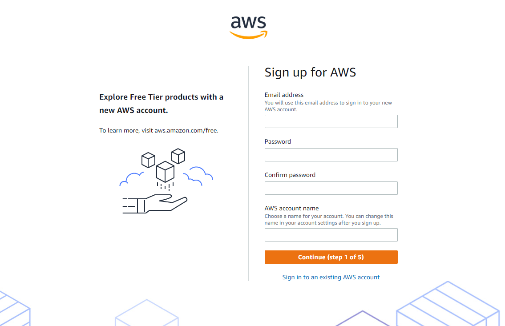

### 2. **Launch an EC2 Instance:**  Navigate to the Amazon EC2 console and choose "Launch Instance."

- 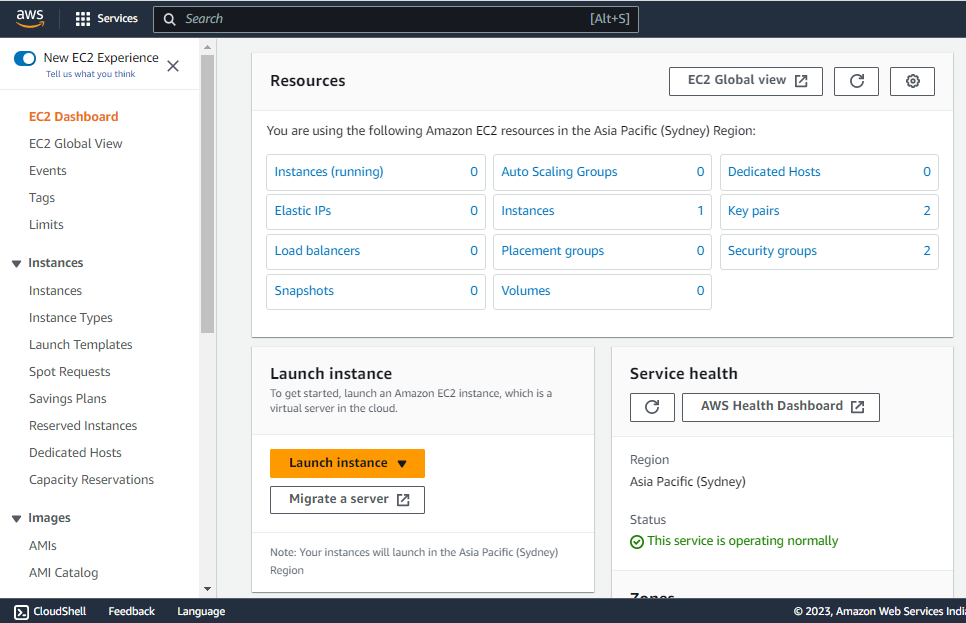

- 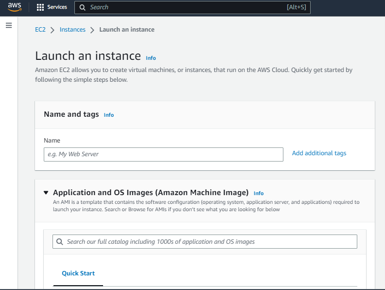

### 3. **Select an AMI (Amazon Machine Image):** An AMI is a pre-configured software bundle containing an operating system and additional software. Choose an AMI that meets your needs, such as a Linux or Windows server image.

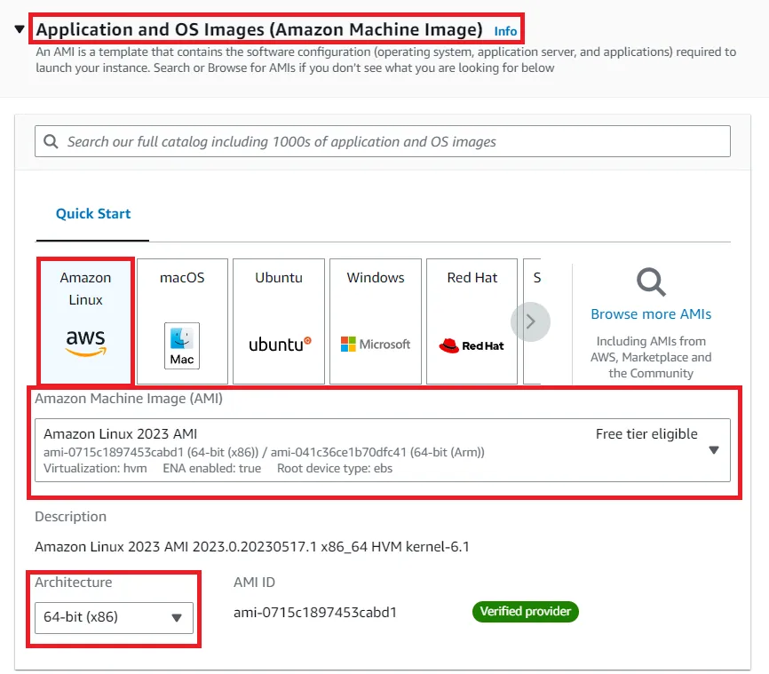

### 4. **Instance Type:** Select an instance type that provides the appropriate computing power and memory for your workload. AWS offers a variety of instance types optimized for different purposes.

- 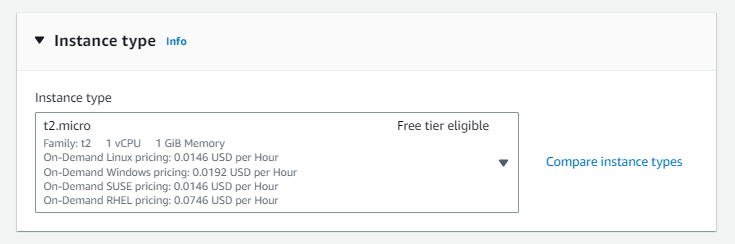

- 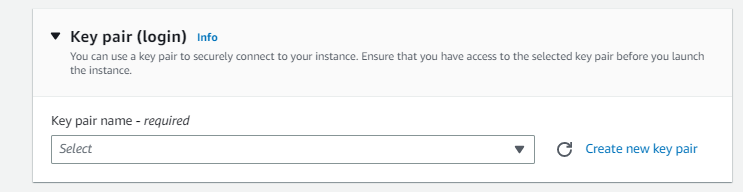

### 5. **Storage and Security:** Configure storage options and security groups to define network access rules for your VM.

- 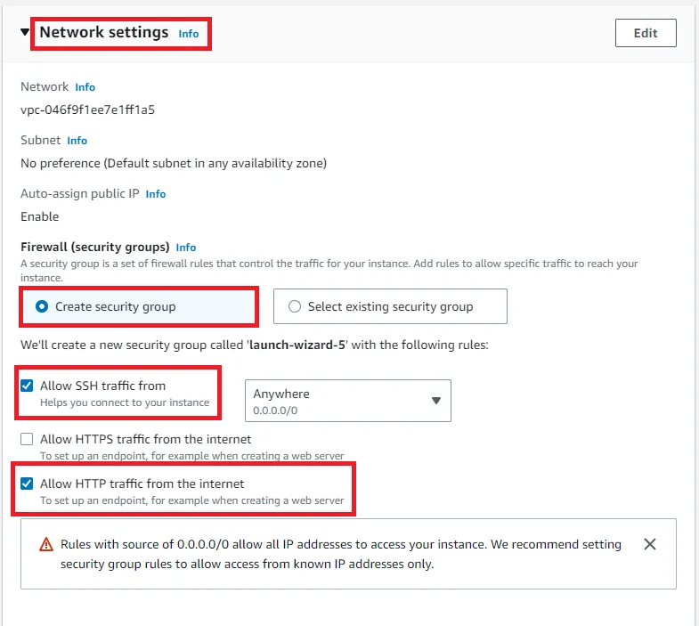

- 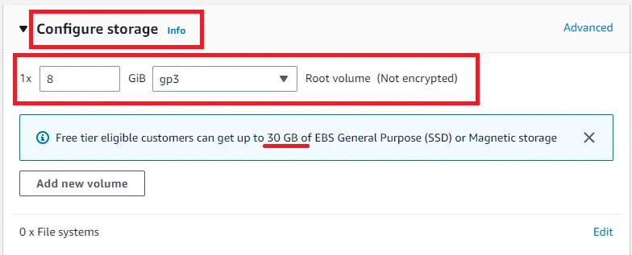

### 6. **Review and Launch:** Double-check your configuration and launch your virtual machine instance.

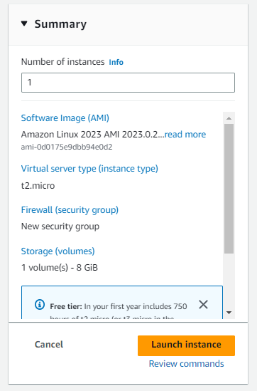

Once launched, you can connect to your VM and start using it! AWS provides various tools for managing and monitoring your virtual machines.

# How to Connect EC2 instance from Windows Laptop using MobaXterm

### Prerequisites
- You need to have an Ubuntu EC2 instance running. [We have discussed above how to create an EC2 instance]
- You need to have MobaXterm installed on your Windows computer.
- You need to have your private key file for your EC2 instance.

## Step 1: Download and install MobaXterm

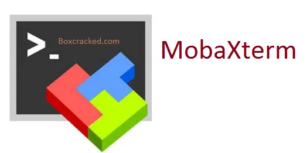

You can download MobaXterm from the MobaXterm website: https://mobaxterm.mobatek.net/. Once you have downloaded the installer, run it and follow the on-screen instructions to install MobaXterm.

## Step 2: Open MobaXterm

Once MobaXterm is installed, open it up. You should see the main MobaXterm window.

## Step 3: Create a new SSH session

To connect to your EC2 instance, you need to create a new SSH session. To do this, click on the Sessions menu and then click on New Session.

## Step 4: Enter the connection details

In the New Session dialog box, enter the following information:
- Host: The public DNS name or IP address of your EC2 instance.
- Username: The username you used when you created your EC2 instance.
- Session type: SSH

## Step 5: Browse to your private key file

Click on the Advanced button and then browse to your private key file. Your private key file is a .pem file that you downloaded when you created your EC2 instance.

## Step 6: Click OK

Once you have entered all of the information, click on the OK button. MobaXterm will connect to your EC2 instance.

## Step 7: You’re connected!

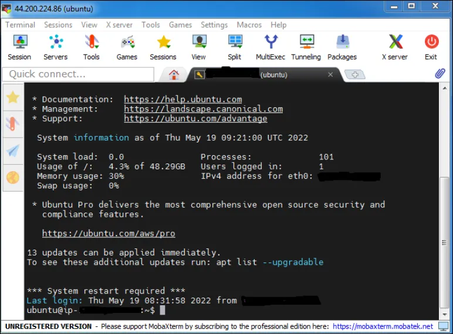

If you have successfully connected to your EC2 instance, you should see a new terminal window open up. You can now start working on your EC2 instance!