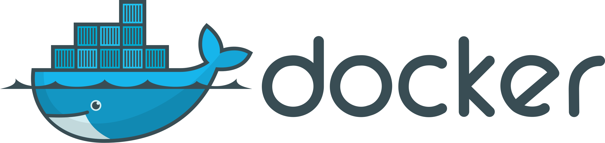

# Docker: Building and Shipping Applications with Ease



Welcome to the Docker section of my DevOps Adventure! This guide is designed to give beginners a solid introduction to Docker, with practical examples and tips to get you started.

## What is Docker?

Docker is an open-source platform that automates the deployment, scaling, and management of applications in lightweight, portable containers. Containers include everything an application needs to run, ensuring consistency across multiple environments.

## Why Docker?

- **Consistency**: Works the same in development, testing, and production.
- **Isolation**: Each container runs in its own isolated environment.
- **Portability**: Containers can run on any system that supports Docker.

## Basic Concepts

- **Dockerfile**: A text file with instructions to build a Docker image.
- **Images**: Blueprints for containers. They contain the application code, libraries, and configuration files needed to run the application. Think of them as recipes for creating containers.

- **Containers**: Isolated instances of an image that are running. Each container has its own file system, processes, and network resources. It's like having a miniature virtual machine (VM) for each application, but much more lightweight and efficient.

- **Registries**: Public or private repositories that store Docker images. Popular public registries include Docker Hub (https://hub.docker.com/). You can pull (download) images from registries and push (upload) your own. 

- **Docker Hub**: A registry to find and share container images.

## Getting Started with Docker

### Installation

1. **Install Docker**: Follow the instructions on the [official Docker website](https://docs.docker.com/get-docker/).

2. **Verify Installation**: Open your terminal and run:
   ```sh
   docker --version
   ```
   
This command should output the Docker version information, confirming successful installation.

---

## What Problem Does Docker Solve?

Docker addresses several key challenges faced by developers and operations teams:

1. **Environment Consistency**: "It works on my machine!🤧" is a common problem in software development. Docker ensures that the software runs in the same way regardless of where it is deployed by packaging applications and their dependencies into containers.


2. **Efficient Resource Utilization**: Unlike VMs, Docker containers share the host OS kernel, making them lightweight and efficient. This allows for running multiple containers on the same hardware, reducing overhead and improving performance.

3. **Speed of Deployment**: Containers can be started and stopped quickly, enabling rapid deployment and scaling. This accelerates development cycles and improves productivity.

4. **Isolation**: Containers provide process and file system isolation, ensuring that applications do not interfere with each other. This improves security and stability.

5. **Portability**: Docker containers can run on any system that supports Docker, including cloud platforms, on-premises servers, and developer laptops, ensuring true portability.

6. **Simplified Dependency Management**: Docker simplifies the management of software dependencies by bundling them within the container, avoiding conflicts between different applications' dependencies.

---

## History Before Docker: Virtual Machines (VMs)

Before Docker, Virtual Machines (VMs) were the primary method for isolating applications and managing resources.

### Key Characteristics of VMs:

1. **Full OS Virtualization**: VMs run a full operating system on top of a hypervisor. Each VM includes its own guest OS, which can be different from the host OS.

2. **Resource Intensive**: VMs require significant resources because they include a complete OS instance. This leads to high overhead in terms of CPU, memory, and storage.

3. **Isolation**: VMs provide strong isolation between applications by running them in separate OS instances.

4. **Slow Boot Times**: Starting a VM involves booting an entire OS, which can take a considerable amount of time.

### Popular Hypervisors:

- **VMware ESXi**: A robust, enterprise-grade hypervisor used for running multiple VMs.
- **Microsoft Hyper-V**: A hypervisor by Microsoft integrated into Windows Server.
- **KVM (Kernel-based Virtual Machine)**: An open-source hypervisor built into the Linux kernel.

---

## Comparison: Docker vs. VMs

| Feature               | Docker                                      | Virtual Machines (VMs)                   |
|-----------------------|---------------------------------------------|------------------------------------------|
| **Isolation**         | Process-level isolation via containers      | Full OS isolation via hypervisors        |
| **Resource Usage**    | Lightweight, shares OS kernel               | Heavy, includes full OS per VM           |
| **Startup Time**      | Fast (seconds)                              | Slow (minutes)                           |
| **Portability**       | High, consistent environments everywhere    | Moderate, dependent on hypervisor        |
| **Management**        | Simplified dependency and version management| Complex, includes OS management          |
| **Performance**       | Near-native performance                     | Higher overhead due to full OS           |

---

## Conclusion

Understanding Docker and its comparison with traditional VMs is essential for modern DevOps practices. Docker's efficiency, portability, and ease of use have made it a fundamental tool in the DevOps toolkit, enabling more agile and reliable software delivery.

---

## References

- [Docker Documentation](https://docs.docker.com/)
- [Virtual Machines (VMs) - Wikipedia](https://en.wikipedia.org/wiki/Virtual_machine)
- [Comparing Containers and Virtual Machines](https://www.redhat.com/en/topics/containers/containers-vs-vms)

---

# How to Dockerize Your HTML, CSS, JS Web Application?

Docker is a powerful tool that helps developers build, share, and run applications quickly and efficiently. In this section, we'll cover the basic Docker commands and walk through the process of dockerizing a simple web application built with HTML, CSS, and JavaScript.

## Step-by-Step Guide to Dockerize Your HTML, CSS, JS Web Application

Let's say you have a web application with the following structure:

```sh
Todo-web-app/
├── index.html
├── styles.css
└── script.js
```

### Step 1: Create a Dockerfile
A Dockerfile is a text file that contains instructions for building a Docker image. Create a file named `Dockerfile` in your project directory with the following content:

```sh
# Use an official nginx image as the base image
FROM nginx:latest

# Copy the web application files to the nginx html directory
COPY . /usr/share/nginx/html

# Expose port 80 to the host
EXPOSE 80
```

### *Explanation*:
- `FROM nginx:latest`: Specifies the base image to use. Here, we are using the latest version of the Nginx web server.

- `COPY . /usr/share/nginx/html`: Copies the contents of your current directory (your web application files) to the Nginx default directory for serving HTML files.

- `EXPOSE 80`: Exposes port 80 on the container so you can access the web server from your host machine.

### Step 2: Build the Docker Image

Run the following command in your project directory to build the Docker image:

```sh
docker build -t Todo-web-app .
```

### *Explanation*:
- `docker build`: The command to build a Docker image.

- `-t Todo-web-app`: Tags the image with the name `Todo-web-app`.

- `.`: Indicates the current directory where the Dockerfile is located.

### Step 3: Run the Docker Container

Once the image is built, you can run it as a container using this command:

```sh
docker run -d -p 8080:80 Todo-web-app
```

### *Explanation*:

- `docker run`: The command to run a Docker container.
- `-d`: Runs the container in detached mode (in the background).
- `-p 8080:80`: Maps port 8080 on your host machine to port 80 in the container.
- `Todo-web-app`: The name of the image to run.

### Step 4: Access Your Application
Open your web browser and go to http://localhost:8080. You should see your web application running!

---