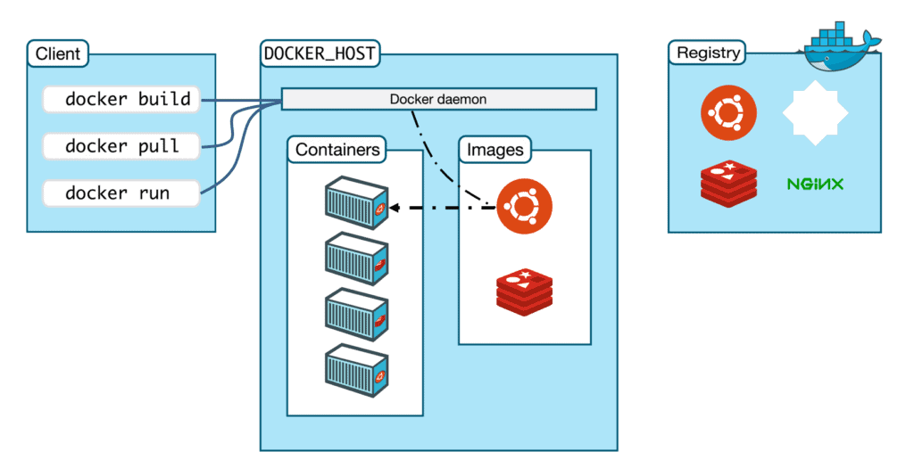

# Docker Architecture

Docker uses a client-server architecture. The docker client talks to the Docker daemon, which used to building, running, and distributing the Docker containers. The Docker client and daemon communicate using a REST API, over UNIX sockets, or a network interface.

## There are five major components in the Docker architecture:

a) **Docker Daemon** listens to Docker API requests and manages Docker objects such as images, containers, networks and volumes.

b) **Docker Clients**: With the help of Docker Clients, users can interact with Docker. Docker client provides a command-line interface (CLI) that allows users to run, and stop application commands to a Docker daemon.

c) **Docker Host** provides a complete environment to execute and run applications. It comprises of the Docker daemon, Images, Containers, Networks, and Storage.

d) **Docker Registry** stores Docker images. Docker Hub is a public registry that anyone can use, and Docker is configured to use images on Docker Hub by default. You can run your own registry on it.

e) **Docker Images** are read-only templates that you build from a set of instructions written in Dockerfile. Images define both what you want your packaged application and its dependencies to look like what processes to run when it’s launched.

Resouces: The best article i prefer to everyone to go through if you want to learn deeply with theoreotical knowledge and understanding.
- https://k21academy.com/docker-kubernetes/docker-tutorial/