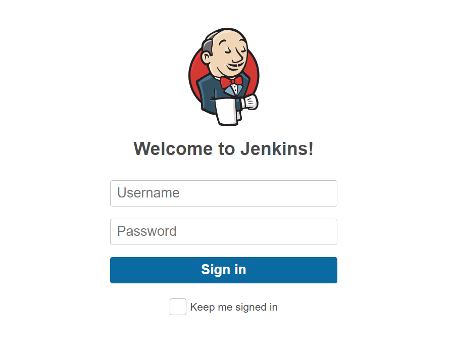
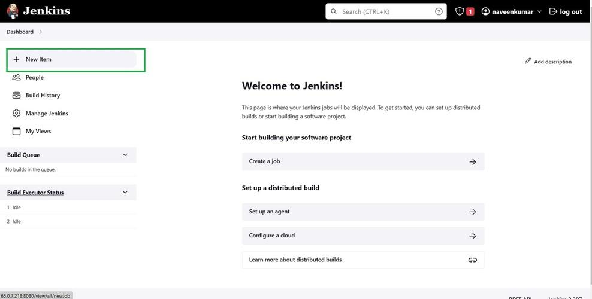
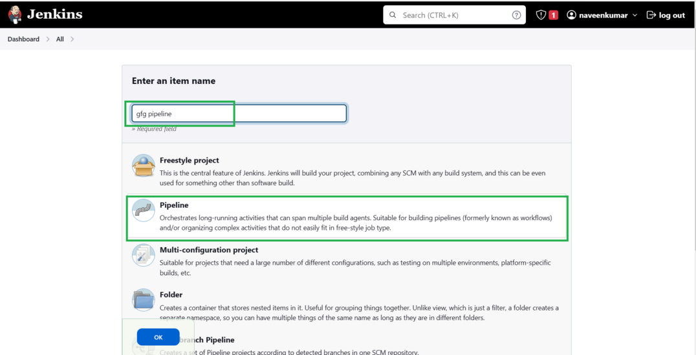
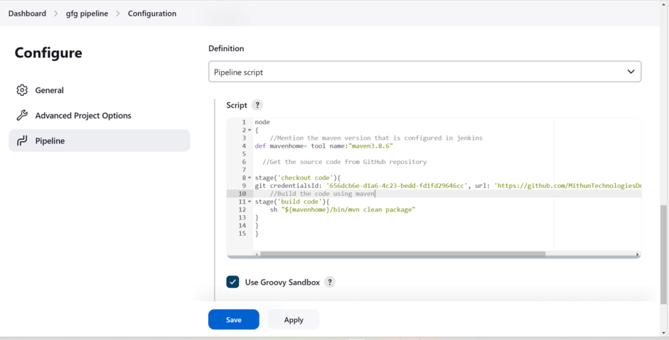

# Creating Basic CI/CD Pipelines with Jenkins

We'll walk through the process of creating a basic CI/CD pipeline using Jenkins. We'll cover the following steps:

1. **Setting up a Jenkins project**
2. **Configuring the source code repository**
3. **Defining the build steps**
4. **Setting up deployment**
5. **Running the pipeline**

## 1. Setting up a Jenkins project

1. **Log in to your Jenkins instance**



2. **Click on "New Item" or "Create Job"**



3. **Enter a name for your project and select "Pipeline"**



4. **Click "OK" to create the project**

## 2. Configuring the source code repository

1. **In the project configuration, scroll down to the "Pipeline" section**



2. **Select "Pipeline script from SCM" as the definition**
3. **Choose the SCM (e.g., Git) and provide the repository URL**
4. **If required, configure credentials for the repository**
5. **Specify the path to your Jenkinsfile (e.g., `Jenkinsfile` or `path/to/Jenkinsfile`)**

## 3. Defining the build steps

1. **Create a file named `Jenkinsfile` in the root of your project repository**
2. **In the `Jenkinsfile`, define the stages of your pipeline using the declarative pipeline syntax**
3. **Example `Jenkinsfile`:**

   ```groovy
   pipeline {
       agent any
       stages {
           stage('Build') {
               steps {
                   // Add build steps (e.g., compiling code, running tests)
                   sh 'mvn clean install'
               }
           }
           stage('Test') {
               steps {
                   // Add testing steps (e.g., running unit tests, integration tests)
                   sh 'mvn test'
               }
           }
       }
   }
   ```

4. **Commit and push the `Jenkinsfile` to your repository**

## 4. Setting up deployment

1. **Add a new stage to your `Jenkinsfile` for deployment**
2. **Example deployment stage:**

   ```groovy
   stage('Deploy') {
       steps {
           // Add deployment steps (e.g., packaging artifacts, uploading to server)
           sh 'mvn package'
           sh 'scp target/*.war user@example.com:/path/to/deploy'
       }
   }
   ```

3. **Customize the deployment steps based on your specific requirements**

## 5. Running the pipeline

1. **Go back to your Jenkins project**
2. **Click "Build Now" to trigger the pipeline**
3. **Monitor the pipeline progress in the Jenkins UI**
4. **Check the console output for each stage to see the build and deployment logs**

That's it! You've now created a basic CI/CD pipeline using Jenkins. Remember to customize the pipeline stages and steps based on your project's specific requirements.

[Blog from gfg about cicd pipeline](https://www.geeksforgeeks.org/how-to-make-a-ci-cd-pipeline-in-jenkins/) 