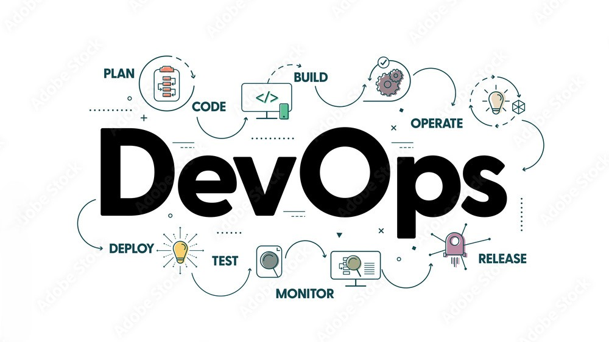

# DevOps-Adventure-
This repository chronicles my exploration of the exciting world of DevOps. Join me as I learn about tools, concepts, and best practices to bridge the gap between development and operations. Expect code snippets, notes on resources, and hopefully, some breakthroughs along the way!

[Follow me on Linkedin](https://www.linkedin.com/in/harsh-ninave-03b665237/)
---
## Index
### Basic
- [DevOps Basics](./Basic/Devops.md)
- [DevOps Tools Guide](./Basic/Tools.md)

### Roadmap
- [DevOps Roadmap](./Roadmap/Roadmap.md)
- [Roadmap Flow](./Roadmap/DevOps_Roadmap.png)

### LECTURE-1 (GIT)
- [Commands](./Lecture_1/GIT/Commands.md)
- [Introduction to GIT](./Lecture_1/GIT/Intro.md)
- [GIT_in_one_image](./Lecture_1/git-in-one-image.jpg)

### LECTURE-2 (LINUX)
- [Linux and it's commands](./Lecture_2/Linux_and_Commands.md)
- [Linux CheatSheet](./Lecture_2/Linux_Cheatsheet.md)
- [Linux CheatSheet PDF](./Lecture_2/Linux_Cheatsheet1.pdf)

### LECTURE-3 (SHELL SCRIPTING)
- [SHELL SCRIPTING](./Lecture_3/Shell_Scripting.md)
- [Shell Scripting essentials pdf](./Lecture_3/Assets/Linux%20Shell%20Scripting%20Essentials.pdf)
- [Best Resource for bash scripting](https://www.zero2devops.com/blog/bash-scripting-cheat-sheet)

### LECTURE-4 (NETWORKING)
- [NETWORKING](./Lecture_4/Networking.md)
- [Resource for Networking](https://blog.kubesimplify.com/networking-fundamentals-for-devops)
- [Networking Notes](./Lecture_4/Assets/Networking_Notes.pdf)

### LECTURE-5 (CLOUD-AWS)
- [Cloud Basics](./Lecture_5/Cloud_Fundamentals.md)
- [AWS_VirtulMachines](./Lecture_5/AWS_VMs.md)
- [AWS BASICS PDF](./Lecture_5/AWS_BASICS.pdf)

### LECTURE-6 (DOCKER)
- [Docker Fundamentals](./Lecture_6/Docker.md)
- [Docker Level 1](./Lecture_6/Docker_levelUP.md)
    - #### Docker Learning resources
    - [Docker Cheatsheet PDF](./Lecture_6/Assets/Docker_basic.pdf)
    - [Docker CheatSheet PDF 2](./Lecture_6/Assets/Docker_basic_2.pdf)
    - [Documentation on Docker](https://k21academy.com/docker-kubernetes/docker-tutorial/)

### LECTURE-7 (JENKINS)
- [Jenkins Introduction and Installation](./Lecture_7/jenkins.md)
- [Jenkins Basics and CI/CD](./Lecture_7/jenkins1.md)